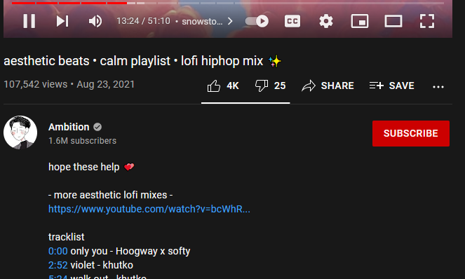
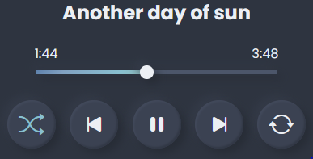
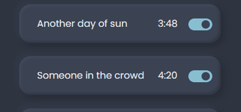
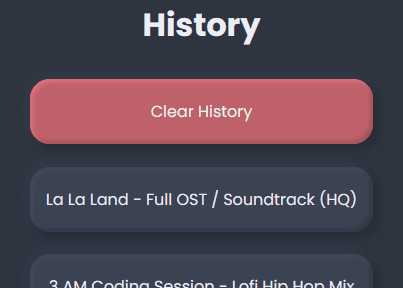

# HoppyTime.io - A Video Player for Timestamps in Youtube Videos
A web application that takes in a YouTube link and returns a video player that allows you to skip, shuffle, repeat, and disable timestamps.

## Table of Contents
- [Demo](#demo)
- [Features](#features)
- [Inspiration](#inspiration)
- [Building from Source](#building-from-source)
- [Contributing](#contributing)
- [Contact](#contact)

## Demo
Video from demo in Youtube: https://www.youtube.com/watch?v=YF1eYbfbH5k
 
Video from demo in HoppyTime: https://hoppytime.io/player/YF1eYbfbH5k

## Features
### Description Timestamps
Timestamps seen in Youtube Videos are taken from the video description. If 
timestamps are present in the description, HoppyTime will also make a playlist 
from that information.

More info: [Youtube Timestamps](https://support.google.com/youtube/answer/9884579?hl=en)

### Comment Timestamps
Oftentimes, timestamps are not present in the video description and a helpful
viewer comments the relevant timestamps instead. If timestamps are not present 
in the description, HoppyTime will search through the top 20 comments instead.

### Player Controls
Play, pause, skip, shuffle, and repeat timestamps like any other music player

### Disable Timestamps
Undesired timestamps can be disabled by clicking on the associated toggle.
Disabled timestamps are taken out of rotation and will be skipped.

### History
A log of previously watched videos will appear in the [History Tab](https://hoppytime.io/history). 
HoppyTime uses the localStorage within the Web Storage API to keep track of this 
information. 

More info: [Web Storage API](https://developer.mozilla.org/en-US/docs/Web/API/Web_Storage_API)

## Inspiration
## Building from Source

## Contributing

## Contact

## Available Scripts

In the project directory, you can run:

### `npm start`

Runs the app in the development mode.\
Open [http://localhost:3000](http://localhost:3000) to view it in the browser.

The page will reload if you make edits.\
You will also see any lint errors in the console.

### `npm test`

Launches the test runner in the interactive watch mode.\
See the section about [running tests](https://facebook.github.io/create-react-app/docs/running-tests) for more information.

### `npm run build`

Builds the app for production to the `build` folder.\
It correctly bundles React in production mode and optimizes the build for the best performance.

The build is minified and the filenames include the hashes.\
Your app is ready to be deployed!

See the section about [deployment](https://facebook.github.io/create-react-app/docs/deployment) for more information.
