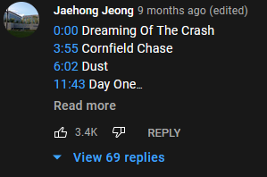

<p align="center"></p>

# HoppyTime.io - A Video Player for Timestamps in Youtube Videos
A web application that takes in a YouTube link and returns a video player that 
allows you to skip, shuffle, repeat, and disable timestamps.

<p align="center">
<a href="https://www.buymeacoffee.com/denmar"></a>
</p>


## Table of Contents
- [Demo](#demo)
- [Features](#features)
- [Technology Used](#technology-used)
- [How to Install](#how-to-install)
- [Inspiration](#inspiration)

## Demo
Video from demo in Youtube: https://www.youtube.com/watch?v=YF1eYbfbH5k
<br>
Video from demo in HoppyTime: https://hoppytime.io/player/YF1eYbfbH5k
<p align="center">

</p>

## Features
### Description Timestamps
Timestamps seen in Youtube Videos are taken from the video description. If 
timestamps are present in the video description, HoppyTime will also make a playlist 
from that information.
<p align="left">


More info: [Youtube Timestamps](https://support.google.com/youtube/answer/9884579?hl=en)
</p>

### Comment Timestamps
Frequently, timestamps are not present in the video description and a helpful
viewer comments the relevant timestamps instead. If timestamps are not present 
in the video description, HoppyTime will search through the top 20 comments 
instead.
<p align="left">

</p>

### Player Controls
Play, pause, skip, shuffle, and repeat timestamps like any other music player
<p align="left">

</p>

### Disable Timestamps
Undesired timestamps can be disabled by clicking on the associated toggle.
Disabled timestamps are taken out of rotation and will be skipped.
<p align="left">

</p>

### History
A log of previously watched videos will appear in the [History Tab](https://hoppytime.io/history). 
HoppyTime uses the localStorage within the Web Storage API to keep track of this 
information. 
<p align="left">

</p>

More info: [Web Storage API](https://developer.mozilla.org/en-US/docs/Web/API/Web_Storage_API)

## Technology Used
### Libaries
- Front End: [React](https://reactjs.org/)
- Routing: [React Router](https://reactrouter.com/)
- HTTP Client: [Axios](https://axios-http.com/)
- Tour: [Intro.js](https://introjs.com/), [intro.js-react](https://github.com/HiDeoo/intro.js-react)

### Design
- Color Palette: [Nord](https://www.nordtheme.com/)
- Stylesheets: [SCSS](https://sass-lang.com/)
- Icons: [Bootstrap Icons](https://icons.getbootstrap.com/)

### API's
- [Video Timestamp API](https://github.com/DenmarFel/timestamp-api)
    - I made this API. It is still a work in progress. It is built with Spring Boot and connects to Youtube Data API under the hood. I plan to open source this once it is polished up.
- [Youtube Iframe API](https://developers.google.com/youtube/iframe_api_reference)

## How to Install
1. Fork this repo
2. Go to root directory
3. Install dependencies: ```npm install```
4. Start React App: ```npm start```
5. Watch SCSS Changes: ```npm run sass```

## Inspiration
Season 4 part 1 of Attack on Titan was airing at the time, and I kept listening 
to this same [lofi playlist](https://www.youtube.com/watch?v=su8jZm-CWZI) over 
and over. It got me through several midterms and final exams. I enjoyed the 
playlist but the repetition began to lower my appreciation for the music. 
The idea for HoppyTime came from this desire to mix things up and continue to 
enjoy a beloved experience.
